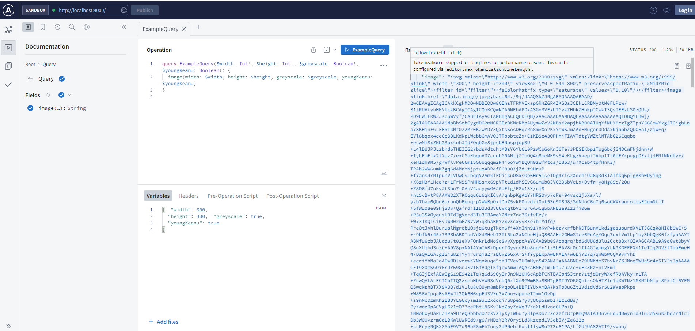

# keanu-server
AstraZeneka code challenge

CLIENT APP

Project Technologies
    - GraphQL
    - TypeScript
    - Apollo Server
    - Docker containerized
Steps to setup
    - clone/fork Repo
    - $ run npm install
    - $ run npm start
When app is running looks like:

Challenge Description:
Full Stack coding challenge
Challenge:
You are tasked with building a web application that allows users to 
retrieve images from https://placekeanu.com/ based on their 
preferred dimensions, whether the image should be grayscale, 
and whether it should be of a young Keanu Reeves. You will need 
to use React on the front-end and a Docker containerized 
backend that uses Apollo Server to handle the API requests.
Requirements:
• Build a Docker containerized backend that uses Apollo Server 
to handle requests from the front-end. The backend should 
have the following features:
• Retrieve images from https://placekeanu.com/ based on user 
input.
• Handle requests from the front-end with the following input 
parameters: image width, image height, option for young 
Keanu, and option for grayscale.
• Use TypeScript for the backend.
• Create a React app that has the following features:
• Use TypeScript for the front-end.
• Use Redux Sagas to handle requests to the backend.
• Display a form that allows the user to input the image width, 
image height, and the options for young Keanu and 
grayscale.
• Include input validation
• When the form is submitted, retrieve the image from the 
backend and display it on the screen.